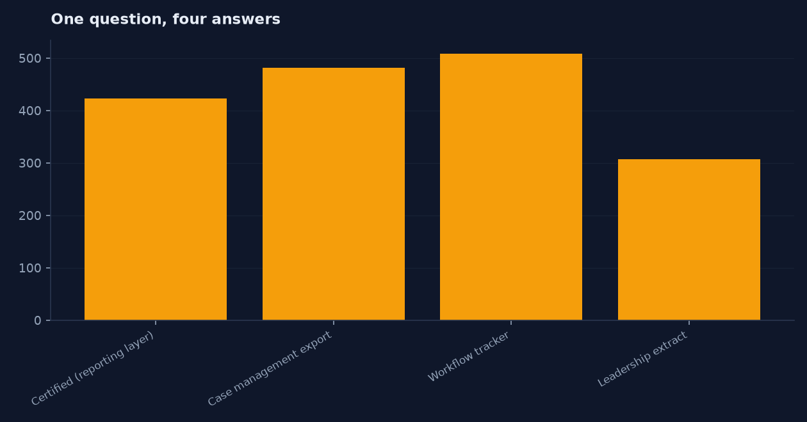
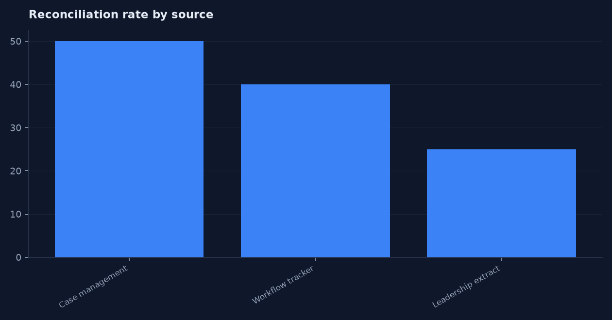
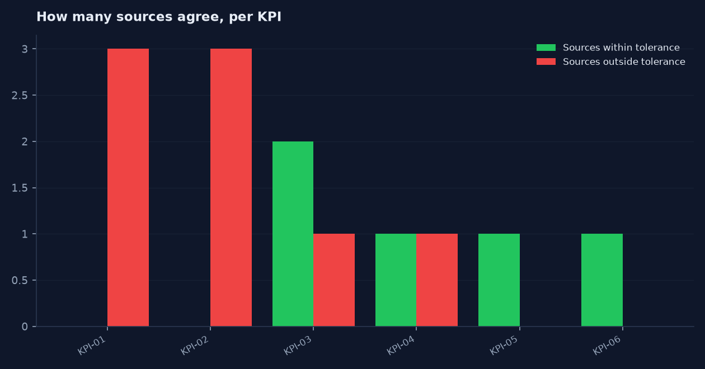

# KPI Trust Ledger

Can leadership trust this number, and if not, exactly why?

**Live dashboard: [https://careersahrafanousi-debug.github.io/kpi-trust-ledger/dashboard/](https://careersahrafanousi-debug.github.io/kpi-trust-ledger/dashboard/)**

Built by [`src/build_dashboard.py`](src/build_dashboard.py) from the query set in
[`dashboard/dashboard_config.json`](dashboard/dashboard_config.json), run against `data/kpi_trust.db`.
Every number on the page comes out of a SQL query held in that config file, so the page
cannot drift away from the analysis in [`sql/`](sql/) — regenerate it with
`python src/load_sqlite.py && python src/build_dashboard.py`. Chosen over a `.pbix`
because a reviewer can open a URL and cannot open a binary.

## Built in four tools, from one set of queries

The 13 SQL queries in [`dashboard/dashboard_config.json`](dashboard/dashboard_config.json)
are the single definition of every number in this repository.
[`src/build_bi_assets.py`](src/build_bi_assets.py) runs them once and emits every
artifact below, so none of them can disagree with each other or with
[`sql/`](sql/). Change a query, rerun, and all four change together.

| Folder | What is in it | Open it with |
|---|---|---|
| [`dashboard/`](dashboard/) | Interactive HTML dashboard, [live here](https://careersahrafanousi-debug.github.io/kpi-trust-ledger/dashboard/) | Any browser, nothing to install |
| [`excel/`](excel/) | `kpi-trust-ledger_dashboard.xlsx` — native Excel charts over `q_*` query sheets | Excel, LibreOffice, Sheets |
| [`tableau/`](tableau/) | `kpi-trust-ledger.twb` — Tableau workbook as reviewable XML | Tableau Desktop or Public |
| [`powerbi/`](powerbi/) | Semantic model in TMDL (16 files) and TMSL, plus 18 DAX measures | Power BI Desktop, Tabular Editor |
| [`charts/`](charts/) | Static PNG renders of the headline findings | Nothing — they are below |
| [`bi_extracts/`](bi_extracts/) | 13 tidy CSV outputs, the shared source for Tableau and Power BI | Anything |

Rebuild everything:

```
python src/generate_data.py
python src/load_sqlite.py
python src/build_dashboard.py
python src/build_bi_assets.py
```

No `.pbix`, `.twbx`, or other binary workbook is committed anywhere. They cannot
be diffed, reviewed in a pull request, or opened without a licence, and they
carry a second copy of the data that drifts away from `data/`. The text formats
above give the same result and stay reviewable. Each folder's `README.md`
explains its own trade-offs, including what has and has not been round-tripped
through the vendor tool.

### Headline charts








Three dashboards at Lone Star Care Operations report three different backlog figures. Nobody
can explain the gap, so leadership has stopped trusting all three. This project builds the
governance layer that answers the question: a KPI catalog with written definitions, three
deliberately inconsistent source extracts, fifteen data-quality rules, a variance
reconciliation with a documented cause for every gap, and a certification gate that refuses
to publish a KPI it cannot defend.

Fictional organization: **Lone Star Care Operations**. All data synthetic.

---

## The business problem

The same question — "how many appeals are open right now?" — returns four different answers
depending on where you ask:

| Definition used | Open backlog |
|---|---|
| Certified reporting layer (excludes Cancelled) | **423** |
| Case management system, anything not Closed | 611 |
| Workflow tracker, anything not Complete | 509 |
| Leadership extract, not Closed (Cancelled already dropped upstream) | 211 |

Every one of those numbers is arithmetically correct. They differ because nobody wrote down
what "open" means, which system owns the answer, or how stale each extract is. That is a
governance problem, not a SQL problem.

## Stakeholders

| Stakeholder | What they need |
|---|---|
| Operations leaders | One certified number per KPI, and honesty when it isn't certified |
| Reporting analysts | Written definitions they can build to |
| Business analysts | Traceability from KPI to source field to quality rule |
| Data owners / stewards | An exception queue they own, with severity |
| Compliance | Evidence that reported figures were validated before distribution |
| IT | Refresh monitoring and freshness alerts |

## Scope and assumptions

In scope: six appeals KPIs, three source extracts, the reporting layer, data-quality rules,
reconciliation, and the certification decision, for the period 2026-01-01 to 2026-06-30.

Out of scope: pipeline orchestration tooling, master data management, access control,
anything downstream of the certified reporting layer.

Assumptions:
- Case management is authoritative for dates, status, payer, type, and SLA target.
- The workflow tracker is authoritative for routing and rework fields, because nothing else
  captures them.
- The leadership extract is authoritative for nothing. It is a consumer, not a source.
- Tolerances: counts must match exactly, percentages within 1 percentage point, time
  measures within 0.25 days.

## Data source statement

Fully synthetic, fixed seed. No employer data, no patient data, no PHI. See
[`docs/PRIVACY.md`](docs/PRIVACY.md).

`data/raw/_ground_truth.csv` exists only so the reconciliation logic can be proven correct.
In a real engagement there is no ground truth file — that is precisely why reconciliation is
hard, and the pipeline never reads it.

---

## The three sources and what is wrong with each

| Source | Rows | Built-in problems |
|---|---|---|
| `case_management_export` | 6,058 | Reopened cases written as duplicate rows; treats Cancelled as open |
| `workflow_tracker_export` | 5,935 | Keyed on intake date but the column is named `Received_Date`; free-text status labels (`COMPLETE`, `Completed`, `in progress`); 90 finished cases never updated; 65 rows missing entirely |
| `leadership_reporting_extract` | 5,743 | Four days stale; Cancelled cases silently excluded; Reopened rolled into Closed; 40 turnaround dates edited by hand in the workbook; payer codes respelled as `Pay 02` |

These are not exotic failure modes. Every one of them is something that happens when
reporting grows by accretion instead of design.

## KPI catalog

| KPI | Definition | Owner | Authoritative source | Unit | Tolerance |
|---|---|---|---|---|---|
| KPI-01 Appeal Volume | Count of appeals received in the period | Appeals Ops Manager | Case system | Count | 0 |
| KPI-02 Open Backlog | Appeals not Closed and not Cancelled as of the reporting date | Appeals Ops Manager | Case system | Count | 0 |
| KPI-03 Median Turnaround | Median days receipt to closure, closed appeals | Reporting Analyst | Case system | Days | 0.25 |
| KPI-04 SLA Compliance | Closed appeals meeting SLA ÷ closed appeals | Quality Lead | Case system | Percent | 1.0 pp |
| KPI-05 First-Pass Routing Accuracy | Appeals with zero reassignments ÷ all appeals | Appeals Ops Manager | Workflow tracker | Percent | 1.0 pp |
| KPI-06 Rework Rate | Appeals with rework ÷ all appeals | Quality Lead | Workflow tracker | Percent | 1.0 pp |

Full field-level definitions: [`docs/03_data_dictionary.md`](docs/03_data_dictionary.md).

## Data quality approach

Fifteen rules in `src/reconcile.py`, documented in
[`docs/07_data_quality_rules.md`](docs/07_data_quality_rules.md). Critical failures block
certification. Every failure is written to `dq_exceptions.csv` with a severity, a
plain-language description, and a named owner — no silent corrections anywhere in the
pipeline.

Last run: 273 exceptions — 1 Critical, 213 High, 59 Medium.

| Rule | Exceptions | Owner |
|---|---|---|
| DQ-03 status disagrees between systems | 90 | Appeals Ops Manager |
| DQ-02 appeal missing from workflow tracker | 65 | Data Steward |
| DQ-13 rework flag missing on a closed appeal | 59 | Quality Lead |
| DQ-01 duplicate appeal ID | 58 | Data Steward |
| DQ-15 extract older than 24 hours | 1 (Critical) | IT / Data Engineering |

## Reconciliation and certification

```
Variance           = Source Value - Certified Value
Reconciliation Rate = KPI/source pairs within tolerance / pairs tested x 100
```

Last run: 13 KPI/source pairs tested, **Reconciliation Rate 38.5%**, **2 of 6 KPIs certified**.

| KPI | Certified value | Sources within tolerance | Certified |
|---|---|---|---|
| KPI-01 Appeal Volume | 6,000 | 0 of 3 | No |
| KPI-02 Open Backlog | 423 | 0 of 3 | No |
| KPI-03 Median Turnaround | 8 days | 2 of 3 | No |
| KPI-04 SLA Compliance | 68.7% | 1 of 2 | No |
| KPI-05 First-Pass Routing Accuracy | 73.73% | 1 of 1 | Yes |
| KPI-06 Rework Rate | 14.38% | 1 of 1 | Yes |

By source: leadership extract 25%, workflow tracker 40%, case management 50%.

### Every variance, with its cause

| KPI | Source | Source value | Certified | Variance | Documented cause |
|---|---|---|---|---|---|
| KPI-01 | Leadership extract | 5,743 | 6,000 | −257 | Four days stale and excludes Cancelled entirely |
| KPI-01 | Workflow tracker | 5,935 | 6,000 | −65 | Keyed on intake date; 65 rows missing |
| KPI-01 | Case management | 6,058 | 6,000 | +58 | Reopened cases duplicated as new rows |
| KPI-02 | Leadership extract | 211 | 423 | −212 | Cancelled excluded, Reopened counted as Closed |
| KPI-02 | Case management | 611 | 423 | +188 | Counts Cancelled as open |
| KPI-02 | Workflow tracker | 509 | 423 | +86 | 90 finished cases never updated |
| KPI-03 | Workflow tracker | 7.0 | 8.0 | −1.0 | Measures from intake, not receipt |
| KPI-04 | Leadership extract | 66.9% | 68.7% | −1.8 pp | Manual date edits plus a different denominator |

The cause column is what separates a reconciliation from a shrug. Nobody can act on
"the numbers don't match."

## Findings

1. **Not one count-based KPI reconciles across any source.** Volume and backlog fail against
   all three extracts, for three different reasons each time.
2. **The stalest source is the one leadership actually reads.** The leadership extract has the
   worst reconciliation rate at 25%, and it is the only one carrying manual edits.
3. **The largest single variance is definitional, not technical.** The 212-case backlog gap is
   entirely about whether Cancelled and Reopened count as open. No pipeline fix addresses it.
4. **Status vocabulary drift causes 90 disagreements.** Free-text status in the tracker
   produced `COMPLETE`, `Completed`, `in progress`, `withdrawn` for four real states.
5. **Percentage KPIs survive missing rows; count KPIs do not.** KPI-05 and KPI-06 certified
   despite 65 missing tracker rows because the rate barely moves, while volume fails outright.
   Worth knowing which metrics are fragile to completeness and which are not.
6. **Everything is still open.** Every one of the 273 exceptions has no resolution date,
   because no owner has ever been assigned one. Time-to-resolve cannot even be measured yet.

## Recommendations

1. **Publish the KPI catalog and make it the only source of definitions.** Nothing goes on a
   leadership dashboard without a catalog entry.
2. **Write down the source-of-truth policy per field.** Case management owns dates and status;
   the tracker owns routing and rework; the leadership workbook owns nothing.
3. **Settle the Cancelled and Reopened question in writing.** This one decision removes the
   largest variance in the ledger.
4. **Replace free-text status with a constrained value list** in the tracker.
5. **Retire the manual leadership extract.** Manual edits in a workbook cannot be governed,
   and it is the least reconcilable source.
6. **Assign every exception an owner and a due date,** then start reporting time to resolve.
7. **Gate certification on Critical exceptions and refresh age.** An uncertified KPI should be
   published as uncertified, not quietly published anyway.

## Future-state governance workflow

See [`docs/09_to_be_process_map.md`](docs/09_to_be_process_map.md): refresh → automated rules
→ exception assignment → KPI reconciliation → Critical issues block certification → owner
resolves and documents → analyst certifies → leadership receives a certified report →
monthly governance review.

## Limitations

- Synthetic data; the inconsistencies are ones I introduced deliberately.
- Tolerances are invented rather than negotiated with a data owner.
- Only two of the three sources feed the reporting layer; a real MDM approach would be wider.
- Exception resolution workflow is specified but not implemented, so time-to-resolve is
  structurally unmeasurable in this build. That is called out rather than hidden.
- No `.pbix` committed. The dashboard is built instead as a live HTML page at
  [https://careersahrafanousi-debug.github.io/kpi-trust-ledger/dashboard/](https://careersahrafanousi-debug.github.io/kpi-trust-ledger/dashboard/) by `src/build_dashboard.py`; the Power BI model and
  measure design remain specified in [`docs/10_dashboard_spec.md`](docs/10_dashboard_spec.md).

## How to run it

```bash
pip install -r requirements.txt
python src/generate_sources.py   # three conflicting extracts
python src/reconcile.py          # reporting layer, DQ rules, reconciliation, certification
python src/load_sqlite.py        # data/kpi_trust.db
sqlite3 data/kpi_trust.db < sql/06_sql_analysis.sql
```

## Privacy statement

This project uses fully synthetic data created for educational and portfolio purposes. It
does not use employer data, patient information, protected health information, or
confidential business information.
