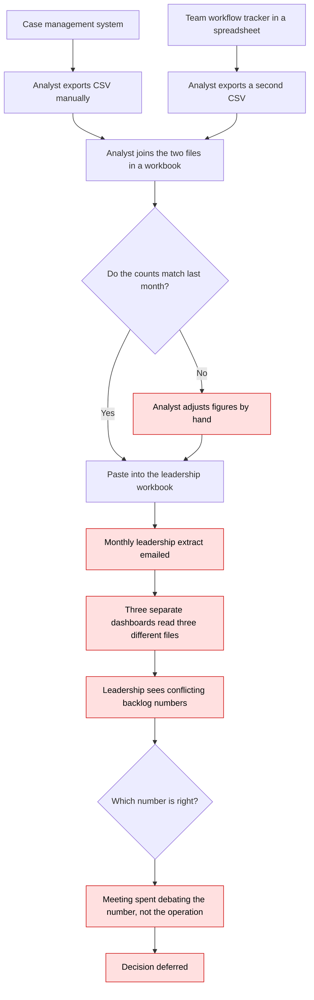

# As-Is Reporting Process — Lone Star Care Operations

How a KPI reaches leadership today.

## Where it breaks

| # | Breakdown | Evidence in the data |
|---|---|---|
| 1 | No written definition of "open" | Backlog ranges from 211 to 611 depending on the source |
| 2 | Manual hand-adjustment of figures | 40 turnaround dates in the leadership extract were reduced by 1-3 days |
| 3 | Free-text status in the tracker | Seven spellings for four real states; 90 disagreements with case management |
| 4 | No refresh monitoring | Leadership extract was 4 days stale and nobody knew |
| 5 | Unmanaged integration gap | 65 appeals exist in case management and not in the tracker |
| 6 | Reopened cases written as new rows | 58 duplicate appeal IDs inflate volume |
| 7 | No quality checking before distribution | Zero rules ran before this project |
| 8 | No owner for a disagreement | 273 exceptions, none assigned, none resolved |
| 9 | Three dashboards, three source files | No certified layer for any of them to read |

## Consequence

The reconciliation rate across the three sources is 38.5%. Four of six KPIs cannot be
certified. The operational data itself is not corrupt — zero records fail a Critical
record-level rule — which is why the problem has survived so long. It looks like a data
problem and it is a governance problem.
