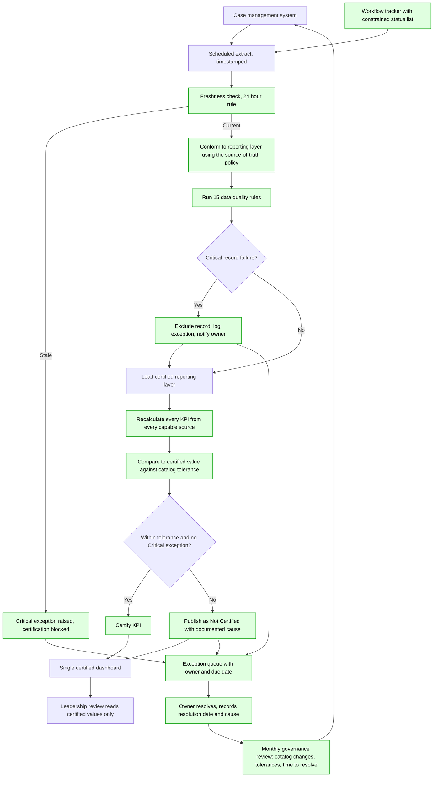

# To-Be Reporting Process — KPI Trust Ledger

## Controls introduced

| Control | Addresses | How it is enforced |
|---|---|---|
| Published KPI catalog | Breakdown 1 | No dashboard tile without a catalog entry |
| Source-of-truth policy per field | Breakdowns 1, 5 | Applied in conformance code, documented in the data dictionary |
| Constrained status value list | Breakdown 3 | Tracker input restricted; DQ-03 monitors residual drift |
| Automated freshness check | Breakdown 4 | DQ-15, Critical on an authoritative source |
| Deduplication policy for reopened cases | Breakdown 6 | DQ-01, first occurrence retained, duplicate logged |
| Fifteen automated rules | Breakdown 7 | Run on every refresh, before publication |
| Certification gate | Breakdowns 1, 4, 7 | Critical exception or out-of-tolerance variance sets Certified to No |
| Exception queue with named owner and due date | Breakdown 8 | Owner on every exception; unassigned exceptions reported |
| Single certified reporting layer | Breakdown 9 | Three dashboards consolidated onto one model |

## What this does not fix

Retiring the manual leadership extract is a decision, not a control. Until someone makes it,
the least reconcilable source continues to exist and the certification gate will keep
reporting it as Not Certified. That is the intended behaviour — the framework surfaces the
decision rather than working around it.

## Implementation sequence

1. Agree and publish the KPI catalog, including the Cancelled and Reopened treatment.
2. Stand up the conformed reporting layer and point one dashboard at it.
3. Turn on the fifteen rules and the exception queue with owners.
4. Add the certification gate and display certification state on every tile.
5. Migrate the remaining two dashboards, then retire the manual extract.
6. Begin reporting time to resolve, and review tolerances quarterly.
